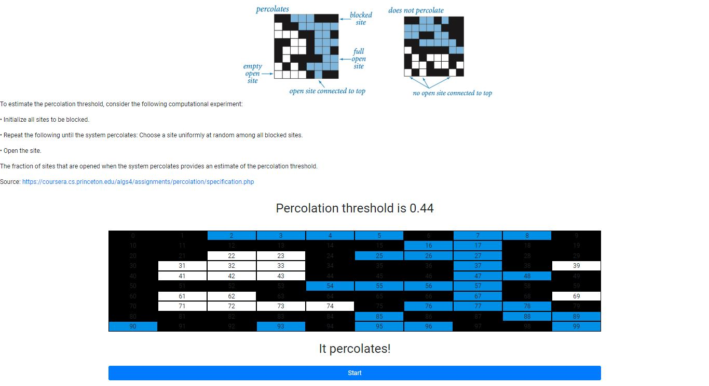

 **Percolation problem**
 
 
Assignment made as part of Alghorithms Course from Princeton University at Coursera. It visualizes percolation problem.

Live demo:  https://sylwiasuwalska.github.io/percolation

 Technologies used:
 - ReactJS
 - Bootstrap 4
 

               

